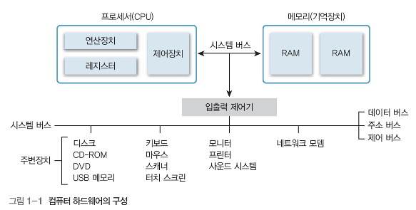
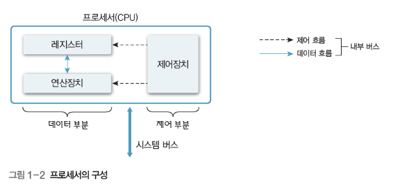
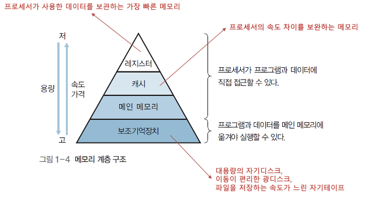
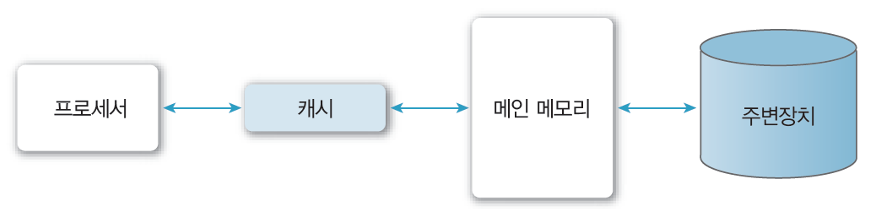

[https://url.kr/ousa6z](https://url.kr/ousa6z)
[https://velog.io/@junnkk/컴퓨터-시스템](https://velog.io/@junnkk/%EC%BB%B4%ED%93%A8%ED%84%B0-%EC%8B%9C%EC%8A%A4%ED%85%9C)

# 컴퓨터 하드웨어

> ⦁ **CPU, 메모리(기억장치), 주변장치**로 구성
⦁ 시스템 버스로 연결되어 있음

## 1. CPU

> ⦁ 모든 장치의 동작을 제어하고 연산 수행
⦁ 레지스터 + 연산장치 + 제어장치 (노란색: 데이터 부분 / 주황색: 제어 부분)

### 레지스터

- **가시 레지스터**: 정보 변경 가능
    - 데이터 레지스터 (DR, Data Register)
    - 주소 레지스터 (AR, Address Register)
- **불가시 레지스터**: 정보 변경 불가능
    - 프로그램 카운터 (PC, Program Counter): 다음 실행할 명령어의 주소 저장
    - 명령어 레지스터 (IR, Instruction Register): 현재 실행하는 명령어 저장
    - 누산기(ACC, Accumulator): 데이터를 일시적으로 저장
    - 메모리 주소 레지스터 (MAR, Memory Address Register): 참조하려는 데이터의 주소 저장
    - 메모리 버퍼 레지스터 (MBR, Memory Buffer Register): 읽거나 저장할 데이터를 보관하는 곳

---

## 2. 메모리 계층 구조

> ➡️ 메모리를 계층적으로 구성하여 **비용, 속도, 용량, 접근 시간**을 상호 보완

- **CPU가 직접 접근 가능**: 레지스터, 캐시, 메인 메모리 (RAM)
- **메인 메모리에 옮겨야 실행 가능**: 보조기억장치(USB, CD, HDD 등등)

---

## 3. 메인 메모리

> ⦁ CPU 외부에 있으면서 수행할 프로그램과 데이터를 저장하거나 CPU에서 처리한 결과를 저장
⦁ 주기억장치 또는 1차 기억장치라고도 부름
⦁ DRAM을 많이 사용함

***_DRAM, Dynamic RAM: 저장된 데이터가 시간과 전원의 끊김에 따라 소멸됨, 휘발성**

- 서로 속도 차이를 보완
- CPU와 보조기억장치 사이에 있으며, 여기서 발생하는 디스크 입출력 병목 현상을 해결하는 역할
    - 병목 현상: 시스템의 전체 성능이나 용량이 하나 또는 n개의 구성 요소나 자원에 의해 제한받는 현상
- CPU와 메인 메모리 사이에도 속도 차이가 있어 부담을 줄이기 위해 캐시 메모리를 사용하기도 함

---

## 4. 캐시(Cache)

> ⦁ **메인 메모리**에 저장된 내용의 일부를 **임시로 저장**해두는 기억장치
⦁ 처리 속도가 빠른 CPU와 상대적으로 느린 메모리의 속도 차이를 보완하는 역할
⦁ CPU 내부나 외부에 있음

</aside>

### 캐시 적중 (Cache Hit) / 캐시 실패 (Cache Miss)

> 참조하려는 정보가 캐시가 있는지(hit) 없는지(miss)

- **캐시 적중**: CPU → 캐시
- **캐시 실패**: CPU ≠> 캐시 and CPU → RAM

> ➡️ 적중이 잘 되려면 캐시에 저장할 데이터가 **지역성**을 가져야 된다.

- **공간적 지역성**: CPU가 참조한 데이터와 인접한 데이터는 참조할 가능성이 높음
- **시간적 지역성**: CPU가 한 번 참조한 데이터는 다시 참조할 가능성이 높음
    - 지역성: 데이터 접근이 시간적, 또는 공간적으로 가깝게 일어나는 것