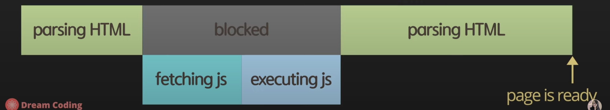
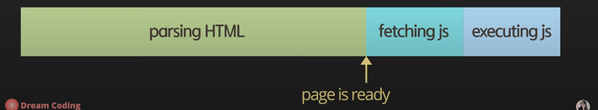
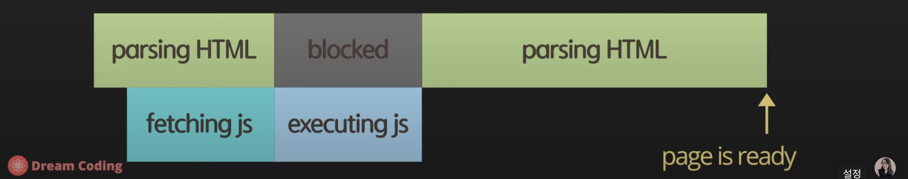
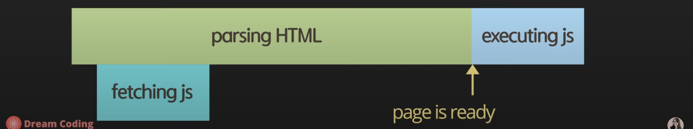
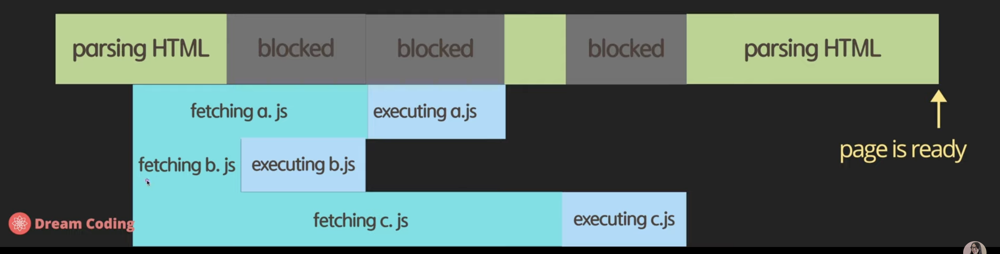
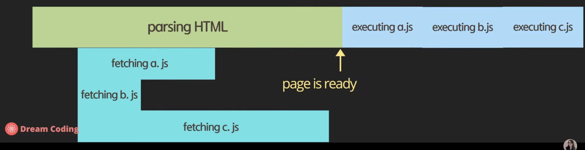

> ➿ **목차 - Hello World! / 환경설정 / async vs defer**
> [자바스크립트 2. 콘솔에 출력, script async 와 defer의 차이점 및 앞으로 자바스크립트 공부 방향 | 프론트엔드 개발자 입문편 (JavaScript ES5+)](https://www.youtube.com/watch?v=tJieVCgGzhs&list=PLv2d7VI9OotTVOL4QmPfvJWPJvkmv6h-2&index=3)

# 자바스크립트 공식 사이트?

> ➿ **ecma-international.org**
> [Home - Ecma International](https://www.ecma-international.org/)

## 추천하는 사이트?

> ➿ **developer.mozilla.org**
> [MDN Web Docs](https://developer.mozilla.org/ko/)

# 1. async vs defer

## 가. HTML code - head

```html
<!DOCTYPE html>
<html lang="ko">
    <head>
        <meta charset="UTF-8" />
        <meta name="viewport" content="width=device-width, initial-scale=1.0" />
        <title>Document</title>
        <script src="./main.js"></script>
    </head>
    <body></body>
</html>
```



## 나. HTML code - body

```html
<!DOCTYPE html>
<html lang="ko">
    <head>
        <meta charset="UTF-8" />
        <meta name="viewport" content="width=device-width, initial-scale=1.0" />
        <title>Document</title>
    </head>
    <body>
        <script src="./main.js"></script>
    </body>
</html>
```



## 다. HTML code - head + async

```html
<!DOCTYPE html>
<html lang="ko">
    <head>
        <meta charset="UTF-8" />
        <meta name="viewport" content="width=device-width, initial-scale=1.0" />
        <title>Document</title>
        <script async src="./main.js"></script>
    </head>
    <body></body>
</html>
```



## 라. HTML code - head + defer

```html
<!DOCTYPE html>
<html lang="ko">
    <head>
        <meta charset="UTF-8" />
        <meta name="viewport" content="width=device-width, initial-scale=1.0" />
        <title>Document</title>
        <script defer src="./main.js"></script>
    </head>
    <body></body>
</html>
```



---

# 1-1. async & defer 차이

## 다-1. head + async

```html
<!DOCTYPE html>
<html lang="ko">
    <head>
        <meta charset="UTF-8" />
        <meta name="viewport" content="width=device-width, initial-scale=1.0" />
        <title>Document</title>
        <script async src="./a.js"></script>
        <script async src="./b.js"></script>
        <script async src="./c.js"></script>
    </head>
    <body></body>
</html>
```



-   정의된 script 태그 순서에는 상관없이 다운로드가 먼저 된 파일부터 실행됨

## 라-1. head + defer

```html
<!DOCTYPE html>
<html lang="ko">
    <head>
        <meta charset="UTF-8" />
        <meta name="viewport" content="width=device-width, initial-scale=1.0" />
        <title>Document</title>
        <script defer src="./a.js"></script>
        <script defer src="./b.js"></script>
        <script defer src="./c.js"></script>
    </head>
    <body></body>
</html>
```



-   HTML 코드를 파싱하는 동안 필요한 .js 파일 모두 다운로드 한 다음에 정의된 순서대로 실행됨
